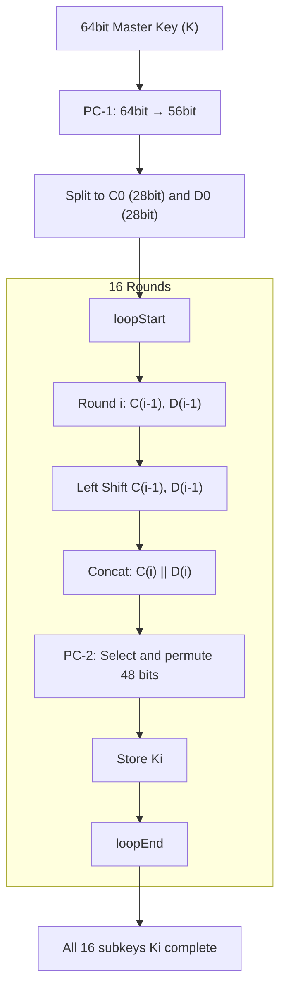
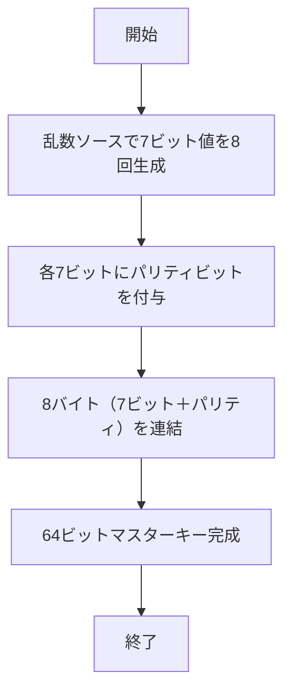

## 0xとULLの意味

- 0x
  0xは、16新数であることを示します。
  例；例: 0x0123456789ABCDEFは16進数で表された64ビットの値です。
- ULL
  ULLは、C++で「unsigned long long型」を明示的に指定するためのサフィックスです。
  U → unsigned（符号なし整数）
  LL → long long（64ビット整数）
  つまり、0x0123456789ABCDEFULLは「符号なし64ビット整数」として扱われます。

- 0x0123456789ABCDEFを2進数に変換

  ```plane
    16進数:  0x0123456789ABCDEF
  ```

  ```plane
    2進数: 0000 0001 0010 0011 0100 0101 0110 0111
          1000 1001 1010 1011 1100 1101 1110 1111
  ```

  ```plane
    ビット位置:  1    2    3    4    5    6    7    8 ... 64
  ```

## IPテーブル（初期置換）

- IPテーブルの一番目の値が58だから置換後の一番目のビットが1になる
- DESアルゴリズム（FIPS PUB 46）で決まったテーブルである。

## ビットの数え方（注意）

- DESや暗号アルゴリズムなどでは、ビットの位置を左から右に数えることが多い。**（１始まり）**
- しかし、C++やプログラミングでの数え方は右から左に数える。**（0始まり）**

## KeySchedule（鍵の取り扱い）



1. マスターキー（64bit。うち8bitはパリィ）から有効な56bitを取り出す（PC-1）
2. 56bitを左右28bitずつ（C0, D0）に分割
3. 各ラウンドごとに左シフト（回転）を行う
4. 結合してPC-2を適用し、48bitのラウンド鍵（サブキー）を得る
5. これを16ラウンド繰り返す。

### なぜ必要なのか？

- DESはFeistel構造であり、各ラウンドで異なる鍵（サブキー）を使って複雑性を高める。
- 一つ目のマスターキーから16個の異なる鍵を作ること「**キー多様性と拡散性**」を生む
- 完全な暗号化には「各ラウンドでこなる動き」が必要で、それを担保するのがサブキー

### 用語補足

| 用語      | 説明                                       |
| ------- | ---------------------------------------- |
| PC-1    | Parity Choice 1：64bit → 56bitの初期選択置換テーブル |
| PC-2    | Parity Choice 2：56bit → 48bitの選択置換テーブル   |
| Cn / Dn | 左右に分けた28bitブロック（ラウンドごとにシフト）              |
| Ki      | ラウンドiで使用される48bitのサブキー                    |

### 出力例

- 入力：マスターキー 0x133457799BBCDFF1（64bit）
- 出力：K1 ~ K16（それぞれ48bit、各ラウンド専用）

### シフトテーブル（DESのアルゴリズムで決まっている（FIPS PUB 46））

下記は完全固定
```cpp
constexpr int SHIFT_SCHEDULE[16] = {
    1, 1, 2, 2, 2, 2, 2, 2,
    1, 2, 2, 2, 2, 2, 2, 1
};
```

## Key generator



1. 7bit乱数を生成する理由

DES仕様では各バイトの最下位ビットをパリティチェック用に使うため、暗号に用いる「実効鍵」は 56 ビット（7×8バイト）です。まずはパリティを含まない 7 ビットずつのランダム値を作ることで、鍵長を正しく確保します。

2. パリティビットの付与理由

各バイトのビット列全体で“1 の数が奇数になるように”パリティビットを設定します。

- 歴史的背景で通信途中のビット反転を検出するための誤り検出機構ですが、仕様として残っているものです。

- これにより「1バイトあたり8ビット」を満たしつつ、実効鍵長は56ビットのままキープできます。

3. バイトごとに連結する理由

生成した 8 バイト（それぞれ7ビット乱数＋1ビットパリティ）を上位バイトから順にシフト＆OR 演算で連結し、最終的に 64 ビットのマスターキーを得ます。

- こうして出来上がる 64 ビット鍵をそのままDESの鍵スケジュールに渡すことで、PC-1 による56ビット抽出と並べ替え処理に続く流れを自然に組めます。